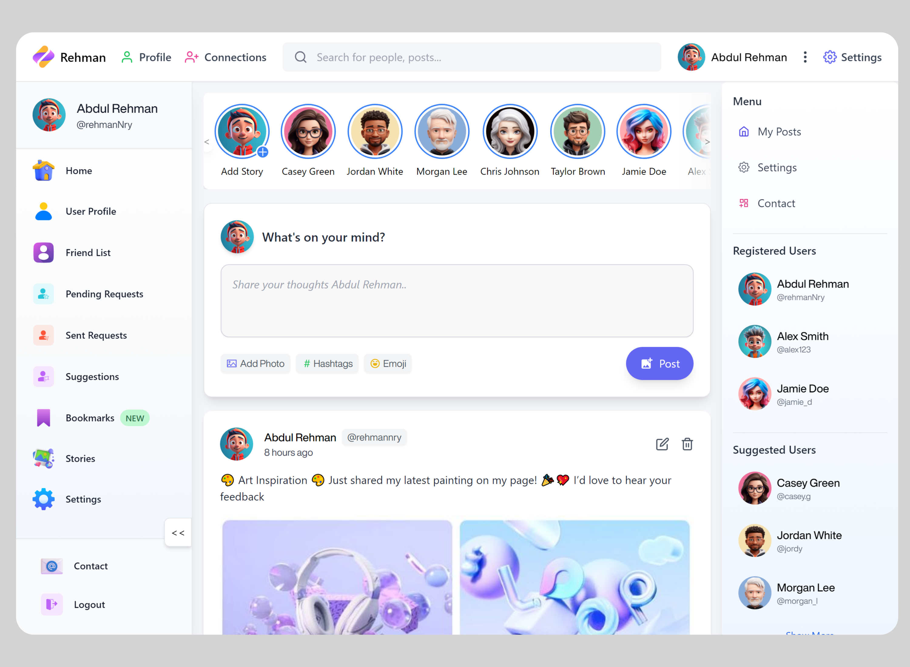

# Social Networking Site - MERN Stack

Welcome to the **Social Networking Site** built using the **MERN Stack** (MongoDB, Express, React, Node.js). This project offers users the ability to connect with each other, share posts, like content, and more, similar to popular social networking platforms.



## 🚀 Live Demo

Check out the live demo of the application [here](https://fb-mern.vercel.app/).

## 📄 Description

This social networking site allows users to:
- Create an account and log in.
- Post updates, photos, and share content with their connections.
- Like and comment on posts.
- Edit their profiles and update personal information.
- View and manage friend requests.
- See real-time updates from other users on their feed.

## 🛠️ Tech Stack

- **Frontend**: React.js with modern hooks and context for state management.
- **Backend**: Node.js and Express.js.
- **Database**: MongoDB for storing user data, posts, and comments.
- **Authentication**: JWT (JSON Web Token) for secure user authentication.
- **Hosting**: Vercel for deployment of the frontend and backend.
  
## 🔧 Features

- User authentication (login, registration, password hashing).
- Post creation, editing, and deletion.
- Like and comment functionality.
- Real-time feed updates.
- Friend request system.
- Profile management (edit user information, update profile picture).
  
## 🖥️ Setup Instructions

To run the project locally, follow these steps:

1. **Clone the repository**:
    ```bash
    git clone https://github.com/your-repo-link
    ```

2. **Install dependencies**:
   - Navigate to both the frontend and backend directories and run:
    ```bash
    npm install
    ```

3. **Set up environment variables**:
   - Create a `.env` file in the root directory of the backend and add the following:
    ```env
    MONGO_URI =
    PORT =
    CORS_ORIGIN=
    JWT_SECRET=
    ```

4. **Start the development server**:
   - Run the backend server:
    ```bash
    npm run dev
    ```
   - Run the frontend React application:
    ```bash
    npm run dev
    ```

5. **Access the app**: 
   - Open your browser and go to `http://localhost:3000` for the frontend and `http://localhost:<Backend Port>` for the backend.

## 👨‍💻 Developer

**Rehman**  
[LinkedIn](https://www.linkedin.com/posts/rehman-nry_finally-completed-that-project-hey-everyone-activity-7242780752663265281-CWtB?utm_source=share&utm_medium=member_desktop)

Feel free to check out the live demo and connect with me on LinkedIn!
